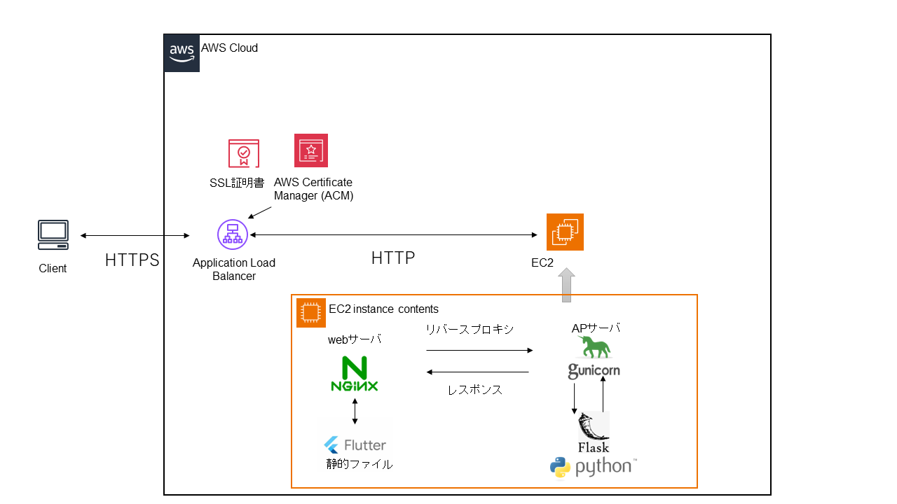
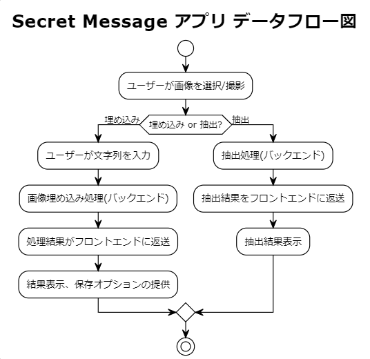

# システム設計書

## バージョン: v1.0.0
作成日: 2024年5月28日  
作成者: 平塚勇聖

## 1. 概要

本設計書は、seacret-messageアプリケーションの全体的なシステム設計を記述します。

## 2. システムアーキテクチャ

### 2.1 全体構成

- フロントエンド: Flutter（クロスプラットフォームモバイル/Webアプリ）
- バックエンド: Python Flask（RESTful API）
- インフラ: AWS

### 2.2 Flutter

#### アーキテクチャ
- MVVM + Repository + DataStore

#### 状態管理
- riverpod

### 2.3 API設計

[API設計書](./steganography-api-design.md)

## 3. 機能要件

### 3.1 画像選択機能
- ギャラリーからの画像選択
- 対応画像フォーマット: {'png', 'jpg', 'jpeg', 'gif'}(iOS端末はheic/heif)
- 最大画像サイズ: 10MB

### 3.2 文字列埋め込み機能
- 画像への文字列埋め込み
- 埋め込み方式: LSB (Least Significant Bit)
- 最大文字数: 1000文字

### 3.3 文字列抽出機能
- 画像からの文字列抽出
- 抽出結果の表示

### 3.4 画像保存機能
- 処理済み画像のローカル保存
- Web版ではファイルでの保存

## 4. 非機能要件

### 4.1 パフォーマンス
- 画像処理時間: 10MB以下の画像で60秒以内

### 4.2 ユーザビリティ
- 直感的なUI設計
- アプリの使い方説明
- レスポンシブデザイン
- 多言語サポート（日本語、英語）

## 5. 画面設計

### 5.1 主要画面
- ホーム画面
- アプリ説明画面
- 埋め込み成功ダイアログ
- 抽出結果ダイアログ
- エラーダイアログ

## 6. データフロー

## 7. セキュリティ設計

### 7.1 データ保護
- 通信の暗号化（HTTPS）

### 7.2 入力検証
- フロントエンドでの入力バリデーション
- バックエンドでの入力サニタイズ

## 8. エラーハンドリング

- ログの記録と管理
- バックエンドのエラー内容はフロントで詳細を表示しない

## 9. 将来の拡張性

### 9.1 各SNS送信時のJPEG圧縮に対してロバストな埋め込みを実現する
参考: https://arxiv.org/pdf/2211.10095

### 9.2 埋め込み文字の暗号化/抽出時の復号処理

### 9.3 アプリ対応
iOS/Androidアプリ申請時は以下を作成する：
- プライバシーポリシー
- 利用規約
- データ保持ポリシー
